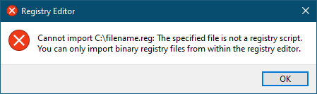

# Windows 10 Registry Hacks

Make Windows a little bit less annoying...

## How to use

1. Clone this repository using [official Git tools][0].
2. Right-click on your registry file of choice.
3. In the menu that opens up, click "Merge".
4. Read and confirm the prompt that shows up.
5. If you see this error, read below

## Why do I get an error?

You may see this error because Windows requires a special encoding
for `*.reg` files and will fail to merge files which do not follow this
encoding. Git always stores file in ASCII or its superset UTF-8, _unless_
overridden by a special `.gitattributes` file.

In order for the files to receive the proper encoding, you **MUST** clone the
repository to your machine, so that Git will utilize the instructions it finds
in `.gitattributes`.

For technical details, check out this answer on Stack Overflow: [Git says
“Binary files a… and b… differ” on for *.reg files][1]

If you continue to see an error even after cloning, it's possible your version
of Git doesn't support the `working-tree-encoding` attribute. The best fix for
this is to update Git.

If cloning or updating Git isn't possible for you, then you can open the file(s)
in Notepad and do "Save as..." and set the encoding to "UTF-16 LE".

## Sources

See each `*.reg` file for individual information.

  [0]: https://git-scm.com/
  [1]: https://stackoverflow.com/a/68932262/51021
